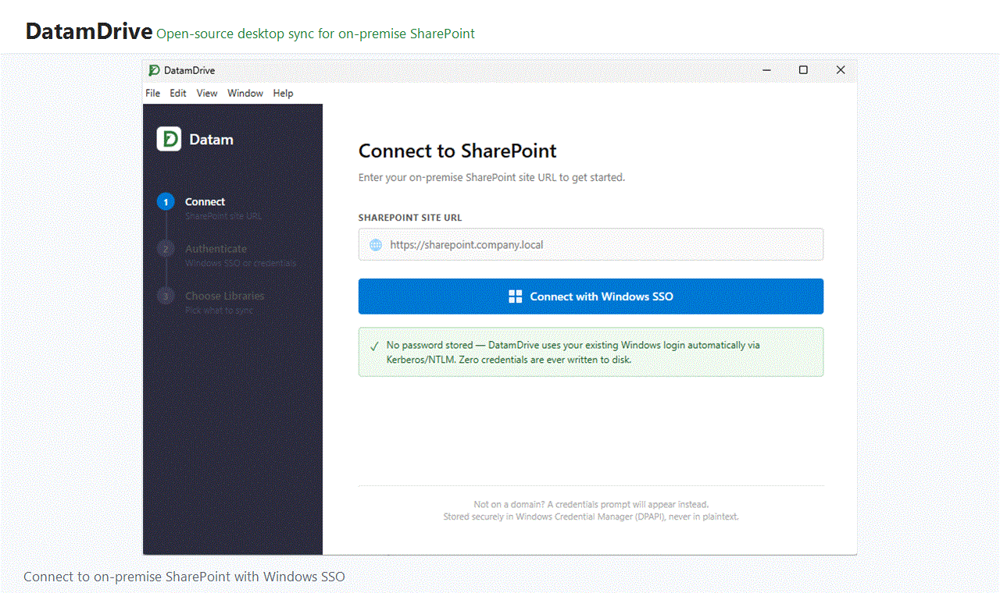

# DatamDrive

DatamDrive is a Windows desktop sync client for on-premise SharePoint. It is intended for organizations that use SharePoint 2016, SharePoint 2019, or SharePoint Subscription Edition and need a OneDrive-like local sync experience without moving documents to Microsoft 365.

The product goal is simple: selected SharePoint document libraries appear in a local folder, changes sync in the background, files open in native Office apps, and SharePoint permissions are respected by the sync engine.

## Preview



## Status

DatamDrive is early-stage software. The repository currently contains the Electron desktop shell, setup flow, tray integration, SQLite-backed local state, SharePoint client scaffolding, polling/watch modules, settings, logging, folder mapping, and tests for selected sync/auth behaviors.

It is not yet a production-ready OneDrive replacement. Treat it as an active implementation of the design in `Docs/`.

## Why This Exists

Microsoft OneDrive no longer covers many on-premise SharePoint sync scenarios. Teams in regulated, sovereign, air-gapped, or legacy environments often still need:

- Files available in Windows Explorer.
- Background upload and download.
- Offline editing with later sync.
- Permission-aware read-only behavior.
- Credential handling suitable for domain environments.
- An auditable open-source client.

DatamDrive targets that gap.

## Core Features

- Windows desktop app built with Electron, React, Node, and TypeScript.
- Setup wizard for connecting to a SharePoint site.
- Windows SSO-first authentication path, with credential fallback support.
- Saved credential restore through Windows Credential Manager when the user has not changed credentials.
- SharePoint document library enumeration.
- Local library registration with a folder picker and per-library local folders.
- Local folders use the SharePoint library display title, while server mapping preserves the real SharePoint root folder URL.
- Duplicate local library folders are suffixed with `_1`, `_2`, and so on.
- Background sync status, activity log, clear logs, pause/resume controls, and settings UI.
- Windows tray menu with idle, syncing, paused, and error states.
- SQLite state store for libraries, sync items, settings, and logs.
- Local file watching with `chokidar`.
- SharePoint access through `@pnp/sp`, `@pnp/nodejs`, and `node-sp-auth`.
- Auto-update plumbing through `electron-updater`.

## Recent Changes

- `da6ab6f` fixed SharePoint library folder mapping. Local sync folders now use only the library display title, for example `اسناد پروژه`, while SharePoint server paths such as `/stage/dev/PMO/ProjectDocuments` are stored separately for upload/download mapping.
- `da6ab6f` added duplicate folder handling. If the target local folder already exists, DatamDrive chooses the next available suffix such as `اسناد پروژه_1`.
- `da6ab6f` cleans stale sync item rows when libraries are removed and handles remounting without `server_url` uniqueness errors.
- `88b9732` added saved credential login from Windows Credential Manager and a Clear Logs control.
- `88b9732` fixed electron-builder publish configuration and added the native dependency postinstall hook.

## Planned Sync Behavior

The sync engine is designed around these rules:

- A user can sync only SharePoint content they can read.
- Read-write libraries allow two-way sync.
- Read-only libraries sync down but block uploads.
- Local and remote edits are compared against stored SharePoint version/ETag state.
- Conflicts should keep both copies by default.
- Deletes should be recoverable through SharePoint behavior where possible.
- Passwords must never be written to plaintext config files.

The detailed product and engineering plan lives in:

- `Docs/Datam-Drive-Roadmap-Plan.md`
- `Docs/DataDrive-Design-2026-06-30.md`

## Tech Stack

- Electron 35
- React 18
- TypeScript
- Vite
- SQLite via `better-sqlite3`
- SharePoint/PnP via `@pnp/sp` and `@pnp/nodejs`
- Auth via `node-sp-auth`
- Credential storage via `keytar`
- File watching via `chokidar`
- Packaging via `electron-builder`
- Tests via Vitest

## Requirements

- Windows 10 or newer.
- Node.js 20 or newer.
- npm.
- Access to an on-premise SharePoint environment for real sync testing.
- Build tools required by native modules such as `better-sqlite3` and `keytar`.

For native dependency issues after installing packages or changing Electron versions, run:

```bash
npm run rebuild
```

## Getting Started

Install dependencies:

```bash
npm install
```

`npm install` also runs `electron-builder install-app-deps` through `postinstall` so native dependencies are rebuilt for the installed Electron version.

Run the development app:

```bash
npm run dev
```

Build the main and renderer bundles:

```bash
npm run build
```

Run tests:

```bash
npm test
```

Create an unpacked desktop build:

```bash
npm run pack
```

Create installer/portable release artifacts:

```bash
npm run dist
```

## Available Scripts

| Script | Description |
| --- | --- |
| `npm run dev` | Builds main once, starts TypeScript watch, starts Vite, then launches Electron. |
| `npm run dev:main` | Watches and builds the Electron main process. |
| `npm run dev:renderer` | Starts the Vite renderer dev server. |
| `npm run dev:electron` | Launches Electron in development mode. |
| `npm run build` | Builds both main and renderer output. |
| `npm run build:main` | Builds the Electron main process. |
| `npm run build:renderer` | Builds the React renderer. |
| `npm run rebuild` | Rebuilds native modules for Electron. |
| `npm run pack` | Builds and creates an unpacked Electron app. |
| `npm run dist` | Builds release installers with electron-builder. |
| `npm test` | Runs the Vitest test suite. |

## Project Structure

```text
assets/                 Windows app and tray icons
dist/                   Build output
Docs/                   Product, architecture, and roadmap notes
src/main/               Electron main process
src/main/auth/          SharePoint authentication
src/main/conflict/      Conflict handling
src/main/db/            SQLite schema and data access
src/main/poller/        Remote polling and initial sync logic
src/main/sp-client/     SharePoint client operations
src/main/sync-engine/   Sync orchestration
src/main/watcher/       Local filesystem watcher and upload queue
src/renderer/           React UI
src/renderer/pages/     Setup, status, and settings screens
src/shared/             Shared IPC types
```

## Security Model

DatamDrive is designed for Windows domain environments first.

- Integrated Windows authentication is preferred.
- Credential fallback uses Windows Credential Manager through `keytar`.
- Saved credentials are reused on app restart when still valid, so users do not need to re-enter unchanged credentials.
- Plaintext passwords should not be stored in application files, logs, or SQLite.
- SharePoint calls run in the Electron main process, not the renderer.
- The renderer communicates through typed IPC boundaries.

## Development Notes

The app stores runtime state under Electron's `userData` directory. Logs are written under a DatamDrive-specific logs folder inside that location and can be cleared from the Recent Activity panel.

When adding a library, the user chooses a parent sync folder. DatamDrive creates one child folder using the SharePoint library display title. The server root folder URL is stored separately so libraries with localized display names still sync to the correct SharePoint path.

The tray icon uses native `.ico` files in `assets/`. If the icon changes while the app is running, fully quit and restart the app so Windows/Electron recreates the tray icon.

## Roadmap

Near-term work:

- Complete reliable two-way sync for selected libraries.
- Harden authentication across NTLM, Kerberos, and explicit credentials.
- Finish permission-aware read-only upload blocking.
- Expand conflict resolution and recovery paths.
- Add broader test coverage for sync edge cases.
- Improve packaging, signing, and update release flow.

Later work:

- Files-On-Demand through Windows Cloud Files API.
- Explorer overlay icons.
- Explorer context menu integration.
- MSI and Group Policy deployment.
- Admin health/telemetry dashboard.
- Additional authentication modes such as ADFS/SAML where required.

## License

This project is intended to be released as MIT-licensed software. Add the repository `LICENSE` file before public distribution.
